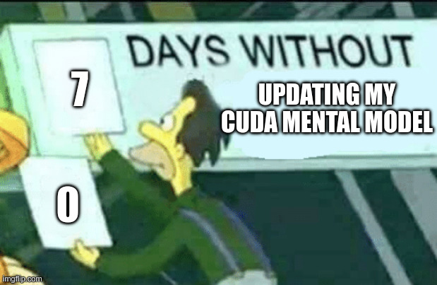
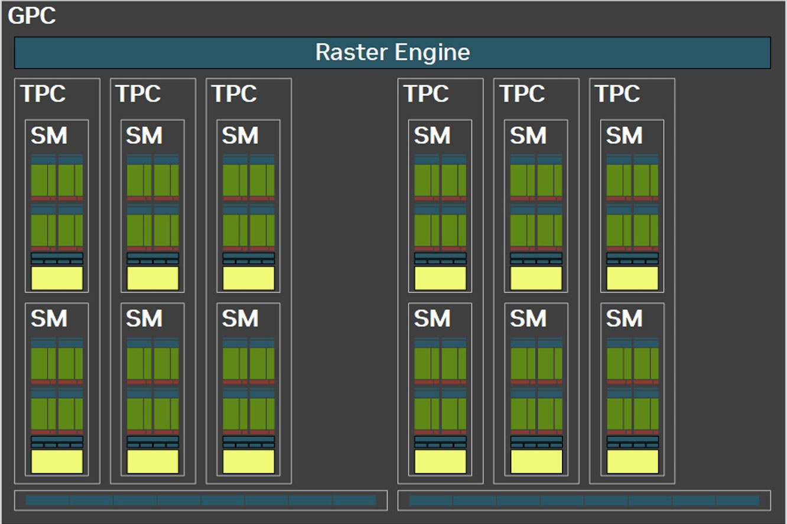

# Thread block clusters
So it turns out in modern CUDA theres another wrinkle to GPU game. Thread block clusters. How exciting! I won't take it personally that this is another bit of complexity that was hidden from me until now, its a bit like when you're learning physics in school and they keep saying "sorry we lied but you weren't ready for this abstraction yet".

- MFW I find out SMs aren't actually fully independent and as of Compute capability 9.0, and that groups of SMs sit with eachother in "graphics clusters"
  - 
  - (Hopper) just after my 3090, conveniently enabled on my 5060ti

## Thread block clusters
- My 5060ti has 3 GPCs, each with 12 SMs inside it.
  - Each of these are quite a bit bigger than i thought they'd be. 12 whole SMs each?
- Inside each of these, CUDA exposes `distributed shared memory` between the blocks inside the GC
  - `Distributed shared memory` is simply the sum of all the `shared memory` for blocks inside the `thread block cluster`.
  - This can be accessed by CUDA on `CC>=9.0`
  - Threads within blocks inside these clusters can communicate via this DSM
- Blocks within the same cluster ---`thread block cluster`--- are guaranteed to be launched on SMs that are in the same GC `graphics cluster`

## Diagram

- [Image from here](https://www.techpowerup.com/review/msi-geforce-rtx-5060-ti-gaming-16-gb/2.html)
- See above the layout of a GC in my 5060ti

## TPCs
30 minutes later, I have been fooled again. It turns out for typical graphics work, there was ALREADY some FURTHER notion of grouping SMs together, a so called `TPC` - `texture processing cluster`
- It was another smaller grouping of SMs together, usually 1 or 2